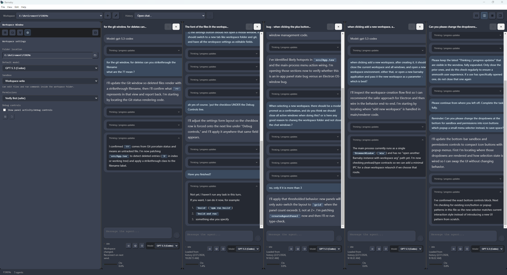
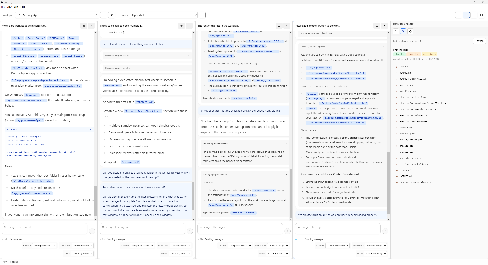

# Barnaby

Barnaby is a desktop AI agent orchestrator that connects to your existing CLI subscriptions (Codex, Claude, Gemini) and delivers better orchestration and windowed agents than Cursor.

- Uses your Codex, Claude, and Gemini CLI logins — no API keys in Barnaby
- Multiple agent panels with split layouts (horizontal, vertical, grid)
- Workspace-oriented UI with per-workspace model defaults and state

Latest Binary Release
[Download Barnaby v0.0.85](https://github.com/incendiosoftware/Barnaby/releases/tag/v0.0.85)
  
Website: https://barnaby.build  
Written By: Stuart Mackereth  
Company: Incendio Trading Limited  
Email: incendiosoftware@gmail.com  

## Screenshots

### Dark



### Light



## Overview

Barnaby provides:

- Multiple agent panels with split layouts (horizontal, vertical, grid)
- Workspace selection and per-workspace defaults
- Model setup and provider routing (Codex, Claude, and Gemini)
- Connectivity checks for Codex, Claude, and Gemini CLIs
- Streaming chat with markdown rendering
- Queue-aware sending and auto-scroll in chat windows
- Menu actions for workspace management (new/open/recent/close/exit)

## Why Barnaby

Barnaby uses local CLI sessions (Codex, Claude, Gemini). You sign in to each provider’s CLI; Barnaby orchestrates them.

- **Orchestration**: Run multiple agents side-by-side, switch workspaces, keep separate conversations per panel
- **Windowed agents**: Split layouts (horizontal, vertical, grid) so you can compare models or keep contexts separate
- **No API keys in Barnaby**: You use your provider subscriptions via their CLI; Barnaby does not handle keys or billing

Compared to Cursor’s single chat: Barnaby gives you parallel windowed agents and workspace-aware orchestration.

## Prerequisites

- Node.js 18+ recommended
- npm
- Codex CLI installed and authenticated (available in `PATH`)
- Claude CLI installed (available in `PATH`)
- Gemini CLI installed and authenticated (available in `PATH`)

## Provider Coverage

- CODEX: full support (connectivity checks + model routing in panels)
- CLAUDE: full support (connectivity checks + model routing in panels)
- GEMINI: full support (connectivity checks + model routing in panels)
- Other CLIs: can be added when they provide a stable non-interactive CLI flow (`--print`/`--prompt` style) and an adapter is implemented

## CLI Setup (Codex + Claude + Gemini)

Barnaby connects to local CLI sessions, so the required CLIs must be installed, signed in, and resolvable from your terminal.

1. Install each CLI from its official docs.
2. Open a new terminal after install.
3. Verify CLIs are available on `PATH`:

```sh
codex --version
claude --version
gemini --version
```

On Windows, you can also confirm command resolution with:

```powershell
where codex
where claude
where gemini
```

4. Authenticate each CLI (follow the provider's login flow). If your CLI supports an explicit auth command, use that; otherwise run the CLI once and complete the sign-in prompts.
5. Sanity-check outside Barnaby by running one simple prompt/command in each CLI you plan to use.

If either command is not found, restart the terminal (or OS) so `PATH` updates apply.

## Development

From repo root:

```sh
npm install
npm run dev
```

## Build Commands

- Standard local build (portable-only artifact): `npm run build`
- Dist-only build (no release artifact): `npm run build:dist`
- Full release build (installer + portable): `npm run build:release`
- Portable build without version bump (for CI/release workflow): `npm run build:portable:raw`
- Releasable prep (bump + notes scaffold + portable build): `npm run release:prepare`

`build:dist` automatically increments the app version on every run.

## GitHub Release Automation

- Trigger release workflow manually after push: `gh workflow run release.yml -f releasable=true --ref main`.
- Manual release in UI: run GitHub workflow `Release` with `releasable=true`.
- Release notes source file: `RELEASE_NOTES_<version>.md` (generate with `npm run release:notes`).

## Project Structure

```text
docs/            Documentation (AGENTS.md, BACKLOG.md, STATUS_LOG.md)
electron/        Electron main and preload
src/             React renderer UI
public/          Static assets
release/         Packaged outputs
```

## Notes

- Workspace root should be the repository root unless you intentionally want broader file scope.
- If Codex fails with `codex app-server closed`, run `codex app-server` manually in terminal to inspect the underlying error.

## Manual Test Checklist

- Multi-instance behavior: open two Barnaby executables at once and confirm both launch successfully.
- Workspace lock behavior: in instance A open workspace `X`, then in instance B try to open the same workspace `X`; confirm instance B is blocked with an in-use message.
- Different workspace behavior: with instance A on workspace `X`, open workspace `Y` in instance B; confirm this is allowed.
- Lock release behavior: close instance A and confirm instance B can then open workspace `X`.
- Crash-stale-lock recovery: force-close instance A (simulate crash), wait for stale timeout, then confirm another instance can claim/open workspace `X`.
