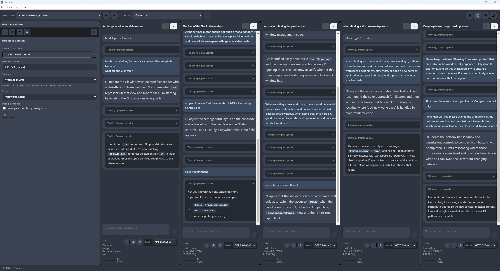

# Barnaby

**Barnaby is a desktop IDE for orchestrating multiple AI coding agents locally.**

Run Codex, Claude, Gemini, and OpenRouter-backed models side-by-side from a single workspace, with separate panels, shared project context, and an optional orchestrator for longer-running agent workflows.

Barnaby lets developers treat AI agents like a team: design with one, code with another, review with a third.

---

## Screenshot



Additional screenshots:

- [Dark theme](docs/screenshots/barnaby-dark.png)
- [Light theme](docs/screenshots/barnaby-light.png)

---

## Features

- Run multiple AI agent sessions simultaneously
- Compare models side-by-side in split or grid layouts
- Orchestrate workflows between agents from a shared workspace
- Works with existing CLI tools such as Codex, Claude Code, and Gemini CLI
- Supports OpenRouter for API-based model access when CLI quotas are exhausted
- Local-first architecture: your code stays on your machine
- Multi-window agent and workspace management
- Built for developers, with explorer, Git, settings, and streaming chat timelines

---

## Why Barnaby?

Most AI coding tools operate one agent at a time.

Barnaby is designed for parallel, role-based workflows where different agents handle different parts of the job while staying anchored to the same codebase.

Example workflow:

- Architecture agent: designs the solution
- Coding agent: implements the change
- Review agent: validates behavior and catches regressions

All running in parallel from one desktop workspace.

Barnaby is also pragmatic about provider choice. You can use the CLI tools you already pay for and sign into, or route requests through OpenRouter when you need broader model coverage.

---

## Installation

Barnaby currently runs by cloning the repository locally.

Requirements:

- Node.js `>=20 <27` (Node 22 LTS recommended)
- `npm`
- Optional provider setup:
  - Codex CLI
  - Claude CLI / Claude Code
  - Gemini CLI
  - OpenRouter API key

Clone and run in development:

```sh
git clone https://github.com/incendiosoftware/Barnaby.git
cd Barnaby
npm install
npm run dev
```

Build a desktop package:

```sh
npm run build
```

Releases:

- https://github.com/incendiosoftware/Barnaby/releases

CLI sanity check after installing providers:

```sh
codex --version
claude --version
gemini --version
```

If the postinstall step reports that a native rebuild was skipped, the embedded terminal will usually still work via prebuilt binaries. Source rebuilds are only needed on platforms where prebuilds are unavailable.

---

## Architecture

Barnaby acts as a local orchestration layer for AI agent processes and provider integrations.

```text
Barnaby Desktop UI
        |
        v
  Workspace + Panel Manager
        |
        v
 Provider / Agent Runtime Layer
   |         |         |         |
   v         v         v         v
 Codex    Claude    Gemini   OpenRouter
  CLI       CLI       CLI        API
```

At a high level:

- `src/` contains the React renderer UI for panels, workspace tools, chat, and layout management
- `electron/main/` manages desktop runtime concerns, provider clients, permissions, updates, and local orchestration
- `electron/preload/` exposes the desktop bridge between the Electron main process and the renderer
- The optional orchestrator plugin extends Barnaby with autonomous agent loops, shared state, and goal persistence

Barnaby is local-first by design. Agent processes run on your machine, workspace context stays in your environment, and provider authentication remains with the CLI tools or API keys you configure.

---

## Roadmap

Current capabilities:

- Multi-agent workspace
- CLI integration for Codex, Claude, and Gemini
- OpenRouter model access
- Local orchestration and workspace-aware context
- Windowed desktop UI with split layouts and workspace tooling

Planned improvements:

- Richer agent collaboration workflows
- Better remote and background agent control
- Plugin ecosystem expansion
- Stronger automation and orchestration primitives
- More onboarding polish and demos for new users

---

## Contributing

Contributions and feedback are welcome.

Open an issue or submit a pull request if you want to help improve Barnaby.

Additional docs:

- [Contributing guide](CONTRIBUTING.md)
- [Security policy](SECURITY.md)

---

## License

MIT
